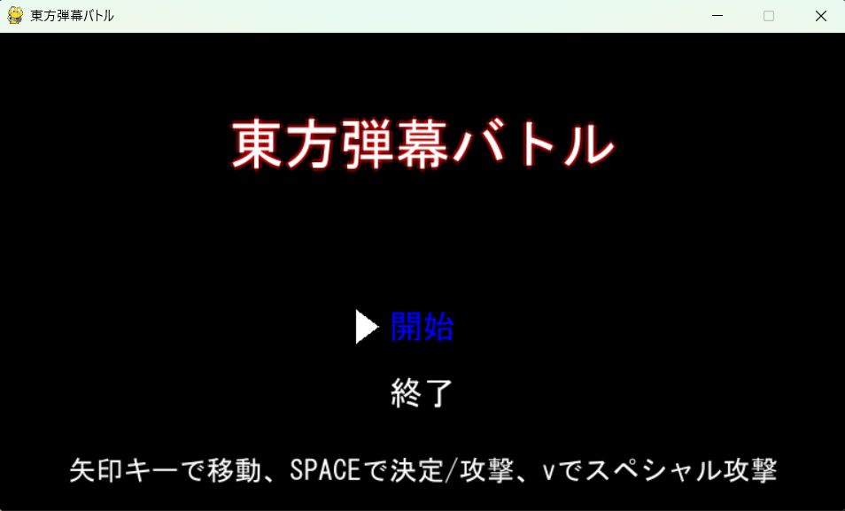
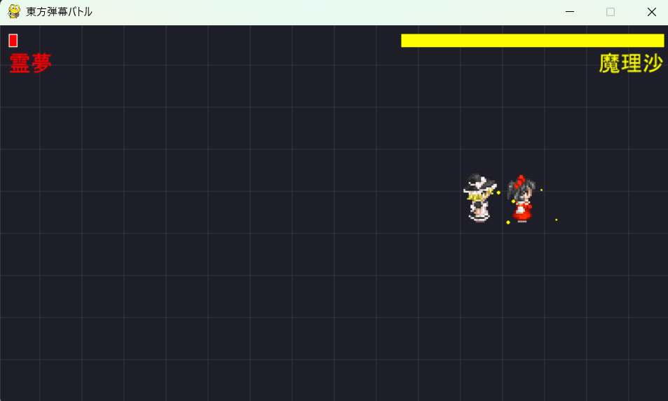
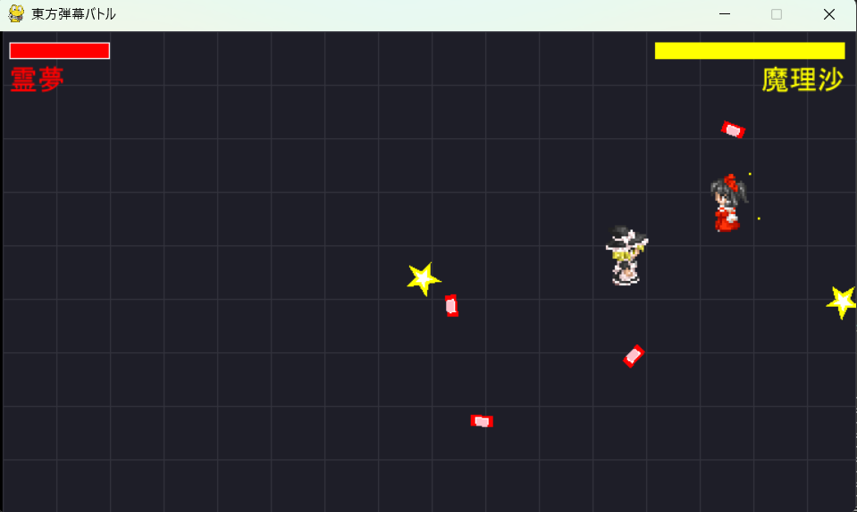
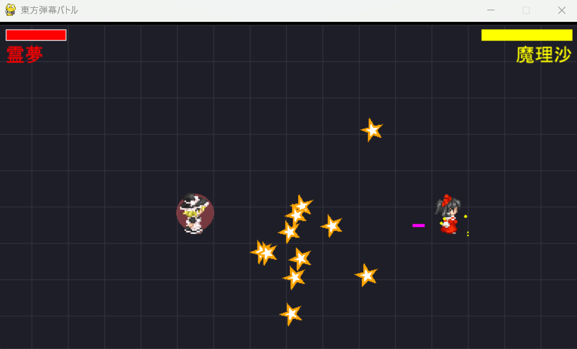
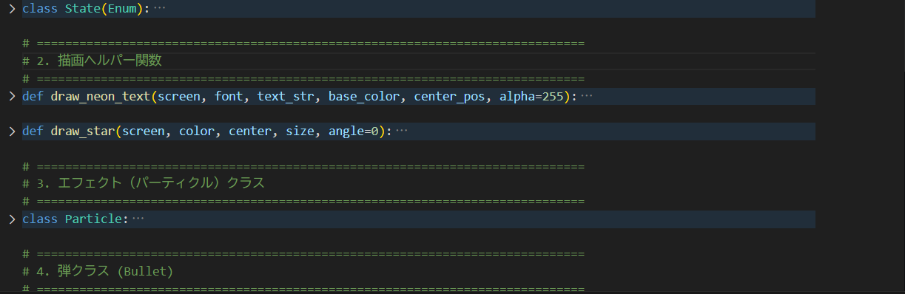
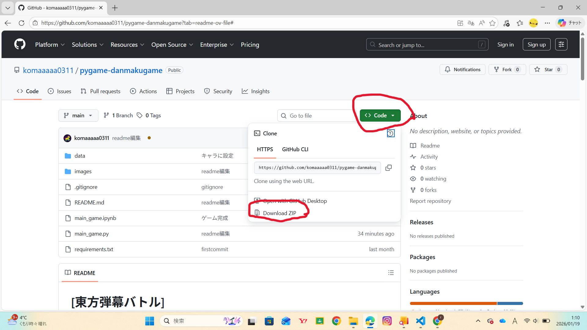

# [東方弾幕バトル]

## 制作時期
2025年12月25日 〜 2026年1月18日

約30時間

## 作品の概要

**【開発のきっかけ】**

Pythonの基本的な文法を学んで、それを応用したアクションゲームを作りたいと思ったのがきっかけです。キャラの素材は、思い付きで東方のキャラがいいなと考え、それをベースにグリッド移動を使った弾幕シューティングゲームの作成に挑戦しました。

**【こだわりポイント1】**

こだわったポイントは操作のしやすさやエフェクトです。例えば、使うキーをスペースキー、ｖキー、矢印キーといったとても少ないキーで操作できるようにして、ゲームがあまり得意ではない人でも楽しめるようにしました。

**【こだわりポイント2】**

戦闘中のエフェクトでダメージを受けたときや与えたときに画面を揺らすことでとても臨場感を出したり、火花を散らすことで、よりゲーム感を出しプレイしている人が飽きにくいようにしました。

**【こだわりポイント3と4】**

 

原作を再現するために、攻撃の弾をお札にしたり、星にしたりキャラ特有の個性も出しました。魔理沙の体力が50％以下になると覚醒状態に入って赤いオーラを纏うなどの工夫もしました。

**【苦労した点】**

苦労した点は、OOPを意識して、プログラムを組むことです。最初は、あまりなれなかったけど、使っているうちにコツをつかんできて、OOPを意識することの便利さや大切さを学びました。実際にプレイしてこだわったポイントや苦労したところを意識しながらプレイしてくれるととてもうれしいです。

## プレイ前の注意点・ゲームルールや操作方法

**動作環境**

* OS: Windows / Mac / Linux
* Python: 3.x系
* ライブラリ: Pygame
## インストール・実行方法

ご自身のPCにソースコードをダウンロード（Clone）した後、以下の手順で実行してください。
※ダウンロードしたZIPファイルは必ずすべて展開してフォルダにしてください
### 1. 依存ライブラリのインストール
ターミナル（またはコマンドプロンプト）でプロジェクトのフォルダを開き、以下のコマンドを実行してください。必要なライブラリ（Pygame）が一括でインストールされます。

pip install -r requirements.txt
### 2. ゲームの起動
上記のことが完了したら以下のコマンドを実行してください。

python main_game.py

## 操作方法・ゲームルール

### 🎮 操作方法

| キー | 動作 |
| :--- | :--- |
| **矢印キー (↑↓←→)** | キャラクターおよびカーソルの移動 |
| **Space** | 決定 / 通常ショット（押しっぱなしで連射） |
| **V** | スペシャル攻撃（強力なお札攻撃） |

### ⚔️ ゲームルール

**【基本ルール】**
制限時間は無制限。1対1の完全決着ルールです。

* **勝利条件**: 敵（魔理沙）のHPを0にする。
* **敗北条件**: プレイヤー（霊夢）のHPが0になる。

**【戦闘のヒント】**
* **Vキーの使い所**: スペシャル攻撃は強力ですが、一度使うと再充填（クールタイム）が必要です。ここぞという場面で使いましょう。
* **敵の覚醒**: 魔理沙のHPが半分を切ると「覚醒状態」になり、攻撃が激しくなります。最後まで気を抜かないでください！
## 主な機能
* **戦略的なグリッドバトルシステム**
    * 上下左右の矢印キーのみで直感的に操作できる16×9マスの移動システム。
    * 敵の弾幕を避けつつ、射線に入って攻撃する位置取りの駆け引きを実現。
* **行動パターンが変化する敵AI（魔理沙）**
    * 敵のHPが50%以下になると「覚醒状態」へ移行。
    * 移動速度の上昇、攻撃頻度の増加、弾幕パターンの変化（星弾の拡散など）など、段階的な難易度上昇ロジックを実装。
* **「手触り」を重視した演出**
    * **被弾時の画面シェイク**: ダメージを受けた瞬間に画面全体を振動させ、衝撃を視覚化。
    * **パーティクルエフェクト**: 着弾時に火花のような粒子を散らせ、攻撃のヒット感を強調。
    * **撃破演出**: 敵HPが0になった際、操作不能→激しい点滅→消滅する演出の実装。
* **キャラクター固有の弾幕アクション**
    * **通常攻撃**: 隙が少なく連射可能なショット弾。
    * **スペシャル攻撃（Vキー）**: クールタイムがある代わりに強力な、原作を模した特殊攻撃。

## 使用技術（スタック）
* VS code
* Python
## 素材・クレジット
* 点睛集積 http://dispell.net/dotcrafts_top.html